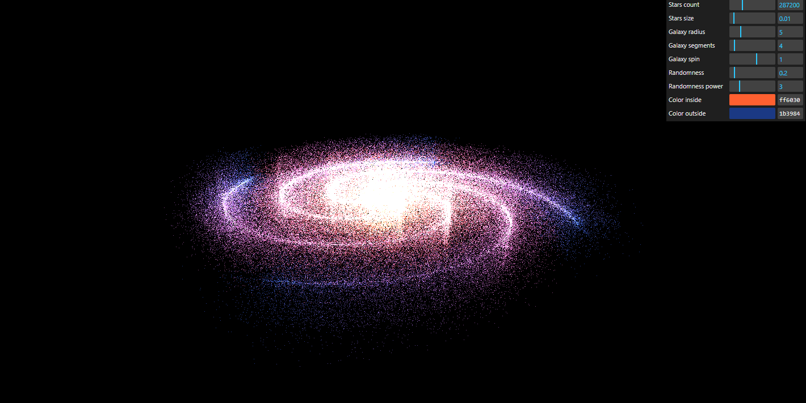

# Galaxy Generator

## Summary

The **Galaxy Generator** is an artistic project built with JavaScript and Three.js that allows users to create stunning, star-filled galaxies. Leveraging particle effects, the app generates hundreds of thousands of stars in real-time, enabling users to create and customize their own galaxies. Users can adjust the number of stars, add new segments to the galaxy, change colors, and even fine-tune the spiral effect to create visually captivating, dynamic galaxies. The project is designed to showcase impressive graphical effects, allowing users to generate up to 1,000,000 stars without sacrificing rendering performance.



## Features

-   🌌 **Create Your Galaxy**: Generate a galaxy filled with stars, customize its appearance, and adjust its parameters.
-   ✨ **Adjustable Star Density**: Increase or decrease the number of stars in your galaxy, with up to 1,000,000 stars supported.
-   🌈 **Customizable Colors**: Modify the colors of stars, galaxies, and the background to create a unique look.
-   🔄 **Spiral Control**: Fine-tune the spiral effect to create more dynamic and engaging galaxies.
-   💨 **Performance Optimized**: Seamless rendering with minimal performance impact, even with up to 1,000,000 stars.
-   🎮 **Interactive UI**: Powered by `lil-gui` for intuitive controls that let you adjust the galaxy's properties in real-time.

## Tech Stack

-   💻 **Frontend**: JavaScript
-   🌠 **3D Graphics**: Three.js
-   🎚️ **UI Controls**: lil-gui (for real-time user interaction)

## Demo

View the live demo of the **Galaxy Generator** at:  
[Live Demo](https://galaxy-generator-001.netlify.app/)

## How to Run Locally

1. Clone the repository:

    ```bash
    git clone https://github.com/Radexman/galaxy-generator.git
    ```
